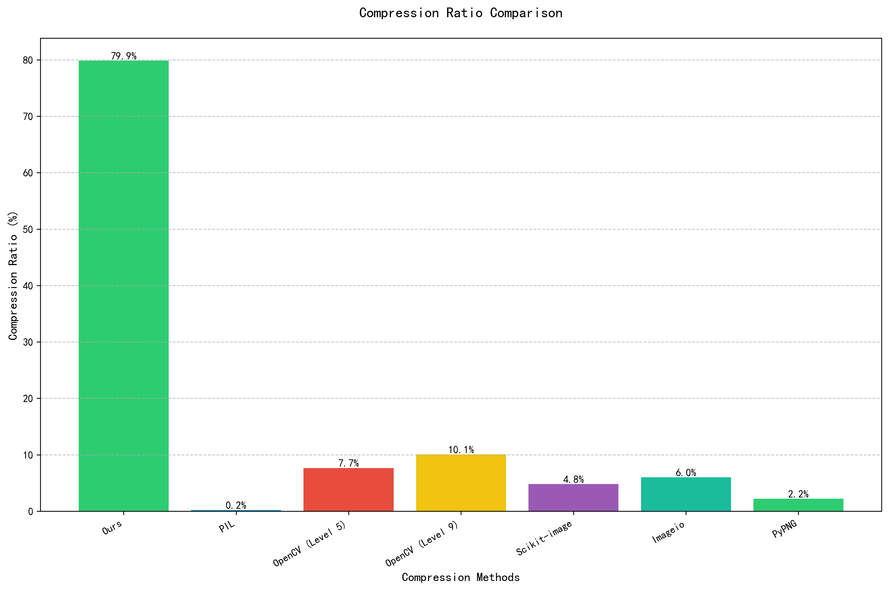

## 1. 概述

本文档详细介绍了一种高效的PNG图像压缩方法，该方法在保持图像原始尺寸、颜色质量和透明度的前提下，能够显著减小文件大小。通过实践，该方法可以将44KB的PNG图像压缩至约9KB，压缩率达到80%左右。

## 2. 压缩原理

### 2.1 颜色模式转换
- 将图像转换为8位调色板模式（P模式）
- 使用中位切分法（method=2）进行颜色量化
- 保留255种颜色用于图像内容，1种颜色用于透明通道
- 通过优化的量化算法保持颜色质量

### 2.2 透明度处理
- 独立处理alpha通道，避免颜色失真
- 二值化处理alpha通道：
  - 阈值为128
  - 小于阈值的像素设为完全透明（0）
  - 大于等于阈值的像素设为完全不透明（255）
- 使用调色板最后一个索引（255）专门表示透明色
- 保留透明区域的原始颜色信息

### 2.3 压缩策略
- 使用最大DEFLATE压缩级别（level 9）
- 启用PNG优化（optimize=True）
- 分离颜色量化和透明度处理，确保最佳效果

## 3. 实验
### 3.1 压缩性能对比




### 3.2  实验

```python
python png_compressor.py # 压缩指定png图片
python compression_comparison.py # 与其他压缩方法进行对比
```


## 4. 性能指标

在测试图像（260x260像素）上的表现：
- 原始大小：44.17 KB
- 压缩后大小：8.89 KB
- 压缩率：79.87%
- 保持原始尺寸
- 保持颜色质量
- 正确处理透明度

## 5. 关键参数
- 颜色数量：255（留1个用于透明）
- 量化方法：中位切分法（method=2）
- Alpha阈值：128
- 压缩级别：9（最大压缩）

## 6. 适用场景

1. 最适合的图像类型：
   - 图标、徽标等色彩相对简单的图像
   - 需要保持透明度的UI元素
   - 网页和移动应用的界面元素

2. 优势：
   - 保持原始图像尺寸
   - 保持良好的颜色质量
   - 正确处理透明度
   - 显著的文件大小减小

3. 注意事项：
   - 渐变色可能会出现轻微的色带
   - 复杂的半透明效果会被二值化
   - 极其细腻的颜色变化可能会损失

## 7. 总结

本压缩方法通过优化的颜色量化和透明度处理，实现了在保持图像质量的同时大幅减小文件大小的目标。通过分离颜色和透明度的处理，确保了最佳的压缩效果。该方法特别适合需要在网络上传输的UI元素和图标，能够在文件大小和图像质量之间取得很好的平衡。 